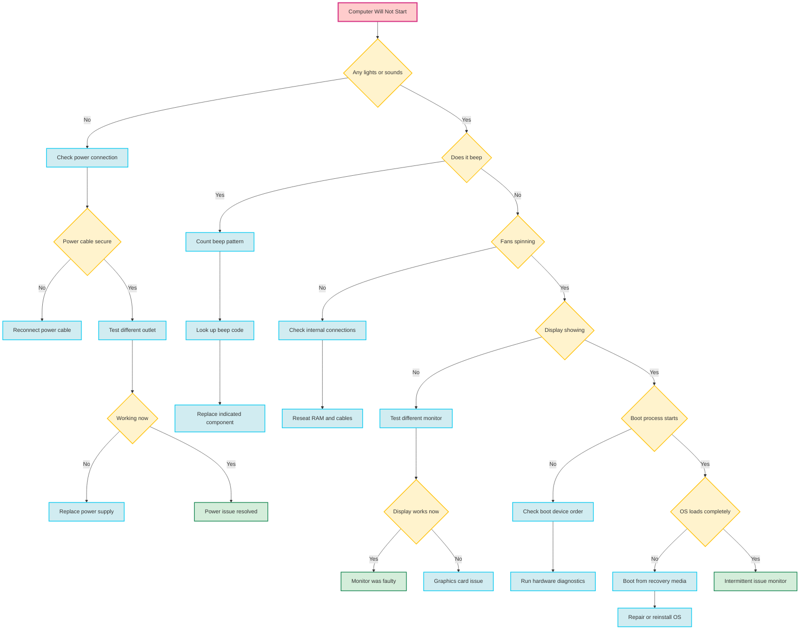

# interactive-mermaid-demo

# Interactive Mermaid Flowcharts

> Transform static Mermaid diagrams into clickable, interactive experiences

## 🚀 [**Live Demo**](https://yourusername.github.io/interactive-mermaid-demo)

This repository demonstrates a breakthrough technique for making Mermaid flowcharts fully interactive. Click on any blue action node in the flowchart to smoothly scroll to detailed content sections.

## ✨ What Makes This Special

- **Clickable Nodes**: Action steps in the flowchart are directly clickable
- **Smooth Navigation**: Clicking scrolls to relevant detailed instructions
- **Elegant Animations**: Subtle hover effects and smooth transitions
- **No External Dependencies**: Just Mermaid + vanilla JavaScript
- **Professional UX**: Color-coded nodes with intuitive interactions

## 📱 Preview



*In the live demo, blue action nodes are clickable and navigate to detailed instructions*

## 🛠️ How It Works

1. **Mermaid Renders** the flowchart as SVG elements
2. **JavaScript Identifies** clickable action nodes by text content
3. **Event Listeners** are added to blue action nodes
4. **Click Handler** smoothly scrolls to corresponding content sections
5. **CSS Animations** provide elegant hover and click feedback

## 🔧 Key Features

### Color-Coded Nodes
- 🔴 **Red**: Starting point
- 🟡 **Yellow**: Decision points (non-clickable)
- 🔵 **Blue**: Action steps (clickable)
- 🟢 **Green**: Success states

### Interaction Design
- **Hover Effect**: Subtle opacity change (no jarring animations)
- **Click Feedback**: Brief opacity reduction for tactile feel
- **Smooth Scrolling**: CSS scroll-behavior with highlight animations
- **Responsive**: Works on desktop and mobile

## 📂 File Structure

```
├── index.html                     # Complete interactive demo
├── src/
│   ├── css/styles.css            # All styling including animations
│   ├── js/flowchart-interactions.js  # Click handling logic
│   └── flowchart.mmd             # Mermaid flowchart definition
└── docs/
    ├── how-it-works.md           # Technical deep dive
    └── implementation.md         # Integration guide
```

## 🚀 Quick Start

1. Clone this repository
2. Open `index.html` in your browser
3. Click on any blue action node in the flowchart
4. Watch it smoothly scroll to detailed instructions

## 💡 Use Cases

This interaction pattern is perfect for:
- **Troubleshooting Guides** (like our computer repair example)
- **Decision Trees** for customer support
- **Process Documentation** with detailed steps
- **Interactive Tutorials** and onboarding flows
- **Workflow Diagrams** with expandable sections

## 🤝 Contributing

Found a bug or have ideas for improvements? Please open an issue or submit a PR!

## 📄 License

MIT License - feel free to use this pattern in your own projects!

---

⭐ **Star this repo** if you found this interaction pattern useful!
