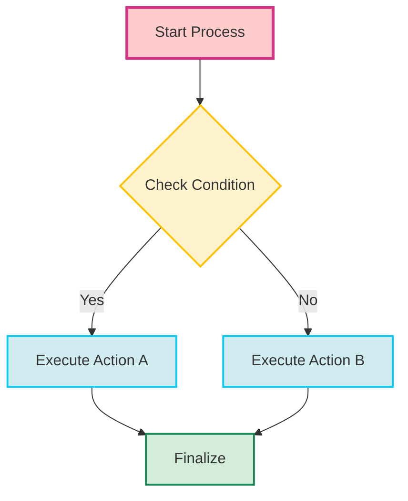
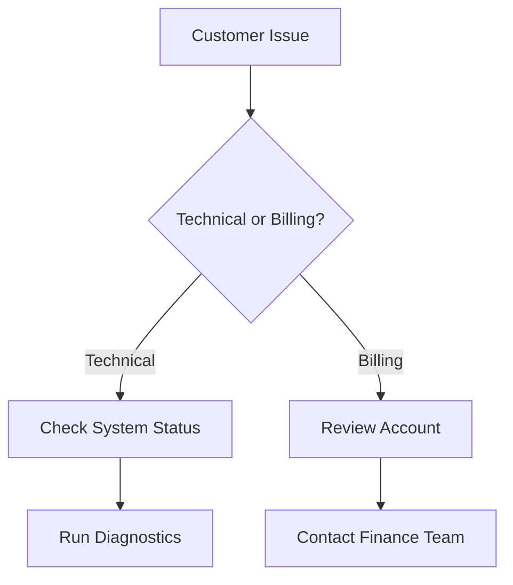
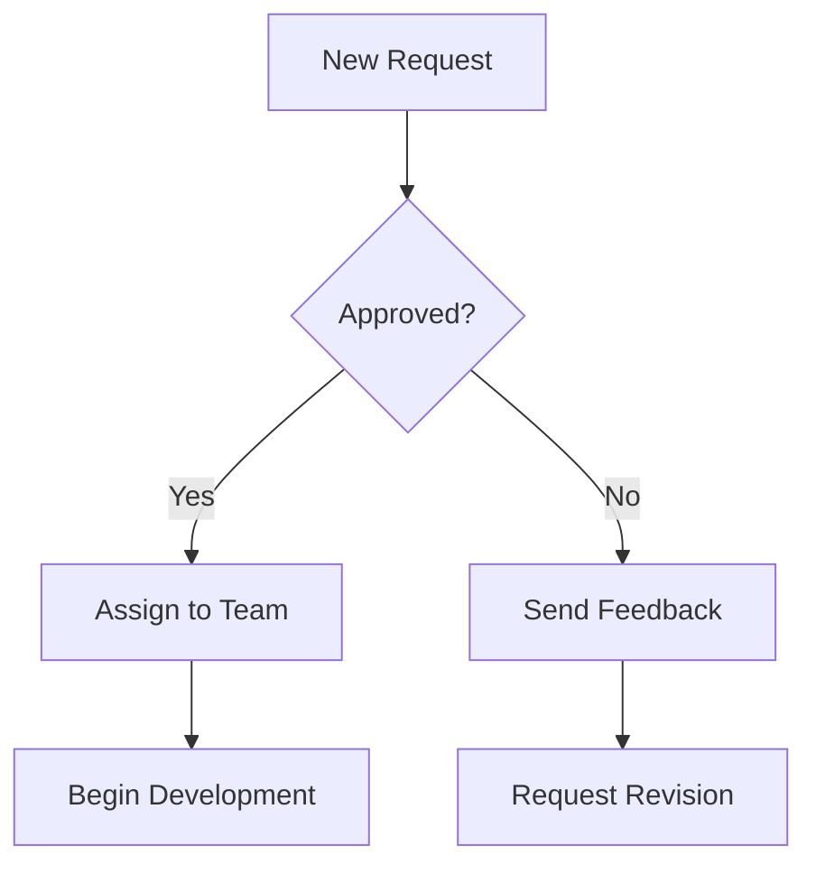
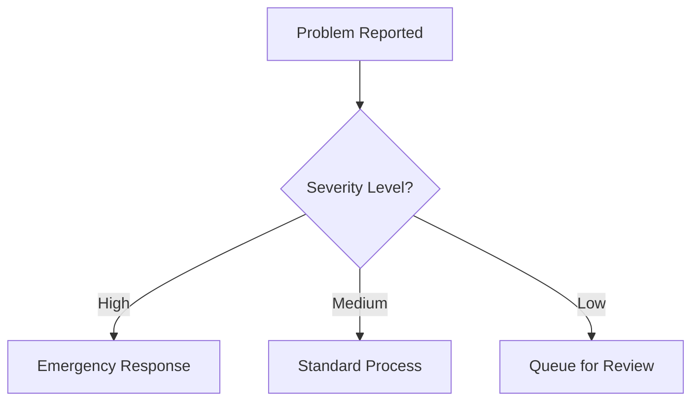

# Implementation Guide

This guide shows you how to add interactive capabilities to your own Mermaid flowcharts.

## Quick Start (5 minutes)

### 1. Basic HTML Setup

```html
<!DOCTYPE html>
<html lang="en">
<head>
    <meta charset="UTF-8">
    <meta name="viewport" content="width=device-width, initial-scale=1.0">
    <title>My Interactive Flowchart</title>
    <script src="https://cdnjs.cloudflare.com/ajax/libs/mermaid/10.6.1/mermaid.min.js"></script>
    <style>
        /* Essential interactive styles */
        .clickable-node {
            cursor: pointer !important;
            transition: opacity 0.2s ease !important;
        }
        .clickable-node:hover { opacity: 0.8 !important; }
        .target-section { 
            scroll-margin-top: 20px;
            transition: background-color 0.3s ease;
        }
        .target-section:target { 
            background-color: #fff3cd !important; 
        }
        html { scroll-behavior: smooth; }
    </style>
</head>
<body>
    <!-- Your flowchart -->
    <div class="mermaid" id="my-flowchart">
        flowchart TD
            A[Start] --> B{Decision?}
            B -->|Yes| C[Action 1]
            B -->|No| D[Action 2]
            C --> E[End]
            D --> E
            
            classDef actionNode fill:#d1ecf1,stroke:#0dcaf0,stroke-width:2px
            class C,D actionNode
    </div>
    
    <!-- Target sections -->
    <section id="action1" class="target-section">
        <h3>Action 1 Details</h3>
        <p>Detailed instructions for Action 1...</p>
    </section>
    
    <section id="action2" class="target-section">
        <h3>Action 2 Details</h3>
        <p>Detailed instructions for Action 2...</p>
    </section>
    
    <script>
        // Initialize Mermaid
        mermaid.initialize({ 
            startOnLoad: true,
            securityLevel: 'loose'
        });
        
        // Add interactivity
        setTimeout(() => {
            const nodeMapping = {
                'Action 1': '#action1',
                'Action 2': '#action2'
            };
            
            document.querySelectorAll('#my-flowchart .node').forEach(node => {
                const text = node.textContent.trim();
                const targetId = nodeMapping[text];
                
                if (targetId) {
                    node.classList.add('clickable-node');
                    node.addEventListener('click', () => {
                        document.querySelector(targetId).scrollIntoView({
                            behavior: 'smooth',
                            block: 'start'
                        });
                    });
                }
            });
        }, 2000);
    </script>
</body>
</html>
```

### 2. Test It

1. Save as `index.html`
2. Open in your browser
3. Click on "Action 1" or "Action 2" in the flowchart
4. Watch it smoothly scroll to the relevant section

## Step-by-Step Integration

### Step 1: Prepare Your Mermaid Flowchart

Create your flowchart with **semantic color coding**:



**Key principles:**
- Use **blue** (`actionNode`) for clickable steps
- Use **yellow** (`decisionNode`) for non-clickable decisions
- Keep node text concise but descriptive

### Step 2: Create Target Sections

Each blue action node should have a corresponding HTML section:

```html
<section id="action-a" class="instruction-section">
    <h3>🎯 Execute Action A</h3>
    <p>Detailed step-by-step instructions for Action A...</p>
    <ul>
        <li>Step 1: Do this</li>
        <li>Step 2: Then this</li>
        <li>Step 3: Finally this</li>
    </ul>
</section>

<section id="action-b" class="instruction-section">
    <h3>🔧 Execute Action B</h3>
    <p>Detailed step-by-step instructions for Action B...</p>
</section>
```

### Step 3: Set Up the Node Mapping

Create a mapping between flowchart text and target sections:

```javascript
const nodeMapping = {
    'Execute Action A': '#action-a',
    'Execute Action B': '#action-b',
    'Your Node Text': '#your-section-id'
};
```

**Matching strategies:**
- **Exact match**: `'Execute Action A': '#action-a'`
- **Partial match**: Check if node text includes key terms
- **Pattern match**: Use regex for complex matching

### Step 4: Add Click Handlers

```javascript
function makeFlowchartInteractive(flowchartId, nodeMapping) {
    setTimeout(() => {
        const flowchart = document.querySelector(flowchartId);
        if (!flowchart) return;
        
        const nodes = flowchart.querySelectorAll('.node');
        console.log(`Found ${nodes.length} nodes to process`);
        
        nodes.forEach((node, index) => {
            const nodeText = node.textContent?.trim() || '';
            console.log(`Processing node ${index}: "${nodeText}"`);
            
            // Find matching target section
            const targetSection = findMatchingSection(nodeText, nodeMapping);
            
            if (targetSection) {
                makeNodeClickable(node, nodeText, targetSection);
            }
        });
    }, 2000); // Wait for Mermaid to render
}

function findMatchingSection(nodeText, mapping) {
    // Try exact match first
    if (mapping[nodeText]) {
        return mapping[nodeText];
    }
    
    // Try partial matches
    for (const [key, section] of Object.entries(mapping)) {
        if (nodeText.includes(key) || key.includes(nodeText)) {
            return section;
        }
    }
    
    return null;
}

function makeNodeClickable(node, text, targetSection) {
    node.classList.add('clickable-node');
    node.style.cursor = 'pointer';
    node.title = `Click for details: ${text}`;
    
    node.addEventListener('click', (e) => {
        e.preventDefault();
        scrollToSection(targetSection);
    });
    
    console.log(`✅ Made "${text}" clickable → ${targetSection}`);
}

function scrollToSection(sectionId) {
    const element = document.querySelector(sectionId);
    if (element) {
        element.scrollIntoView({ 
            behavior: 'smooth', 
            block: 'start' 
        });
        highlightSection(element);
    }
}

function highlightSection(element) {
    element.style.backgroundColor = '#fff3cd';
    element.style.transform = 'scale(1.01)';
    
    setTimeout(() => {
        element.style.backgroundColor = '';
        element.style.transform = '';
    }, 3000);
}
```

### Step 5: Initialize Everything

```javascript
document.addEventListener('DOMContentLoaded', function() {
    // Configure Mermaid
    mermaid.initialize({ 
        startOnLoad: true,
        securityLevel: 'loose',
        theme: 'default'
    });
    
    // Define your mappings
    const myNodeMapping = {
        'Execute Action A': '#action-a',
        'Execute Action B': '#action-b'
    };
    
    // Make it interactive
    makeFlowchartInteractive('#my-flowchart', myNodeMapping);
});
```

## Advanced Customization

### Custom Click Actions

Instead of scrolling, trigger other actions:

```javascript
function makeNodeClickable(node, text, action) {
    node.addEventListener('click', (e) => {
        e.preventDefault();
        
        switch(action.type) {
            case 'scroll':
                scrollToSection(action.target);
                break;
            case 'modal':
                openModal(action.modalId);
                break;
            case 'navigate':
                window.location.href = action.url;
                break;
            case 'function':
                action.callback();
                break;
        }
    });
}

// Usage
const advancedMapping = {
    'Open Settings': { type: 'modal', modalId: 'settings-modal' },
    'Go to Dashboard': { type: 'navigate', url: '/dashboard' },
    'Run Analysis': { type: 'function', callback: () => runAnalysis() },
    'Show Details': { type: 'scroll', target: '#details-section' }
};
```

### Multiple Flowcharts

Handle multiple flowcharts on one page:

```javascript
const flowchartConfigs = [
    {
        id: '#flowchart-1',
        mapping: { 'Step A': '#section-a', 'Step B': '#section-b' }
    },
    {
        id: '#flowchart-2', 
        mapping: { 'Process X': '#process-x', 'Process Y': '#process-y' }
    }
];

flowchartConfigs.forEach(config => {
    makeFlowchartInteractive(config.id, config.mapping);
});
```

### Visual Feedback Customization

```css
/* Subtle hover effect */
.clickable-node:hover {
    opacity: 0.8;
    transform: translateY(-1px);
}

/* Pulse animation for clickable nodes */
@keyframes subtle-pulse {
    0%, 100% { opacity: 1; }
    50% { opacity: 0.8; }
}

.clickable-node {
    animation: subtle-pulse 3s ease-in-out infinite;
}

/* Custom highlight colors */
.target-section:target {
    background: linear-gradient(90deg, #fff3cd, #ffffff);
    border-left: 4px solid #ffc107;
    padding-left: 20px;
}
```

## Framework Integration

### React Integration

```jsx
import { useEffect, useRef } from 'react';
import mermaid from 'mermaid';

function InteractiveFlowchart({ definition, nodeMapping }) {
    const chartRef = useRef();
    
    useEffect(() => {
        mermaid.initialize({ startOnLoad: false });
        
        if (chartRef.current) {
            mermaid.render('flowchart', definition).then(({ svg }) => {
                chartRef.current.innerHTML = svg;
                
                // Add interactivity
                setTimeout(() => {
                    makeFlowchartInteractive(chartRef.current, nodeMapping);
                }, 100);
            });
        }
    }, [definition, nodeMapping]);
    
    return <div ref={chartRef} className="mermaid-container" />;
}
```

### Vue Integration

```vue
<template>
    <div ref="flowchart" class="mermaid-flowchart"></div>
</template>

<script>
import mermaid from 'mermaid';

export default {
    props: ['definition', 'nodeMapping'],
    mounted() {
        this.renderFlowchart();
    },
    methods: {
        async renderFlowchart() {
            mermaid.initialize({ startOnLoad: false });
            const { svg } = await mermaid.render('chart', this.definition);
            this.$refs.flowchart.innerHTML = svg;
            
            setTimeout(() => {
                makeFlowchartInteractive(this.$refs.flowchart, this.nodeMapping);
            }, 100);
        }
    }
};
</script>
```

## Troubleshooting

### Common Issues

**1. "Nodes not clickable"**
```javascript
// Check if Mermaid has rendered
setTimeout(() => {
    const nodes = document.querySelectorAll('.node');
    console.log(`Found ${nodes.length} nodes`);
    if (nodes.length === 0) {
        console.log('Mermaid not rendered yet, retrying...');
        setTimeout(() => addClickHandlers(), 2000);
    }
}, 3000);
```

**2. "Click handlers not working"**
```javascript
// Ensure proper event handling
node.addEventListener('click', (e) => {
    e.preventDefault();
    e.stopPropagation(); // Prevent event bubbling
    console.log('Node clicked:', nodeText);
    // Your action here
});
```

**3. "Styles not applying"**
```css
/* Use !important to override Mermaid's styles */
.clickable-node {
    cursor: pointer !important;
    opacity: 1 !important;
}
```

### Debug Mode

```javascript
function debugFlowchart(flowchartId) {
    const flowchart = document.querySelector(flowchartId);
    console.log('Flowchart element:', flowchart);
    console.log('Nodes found:', flowchart?.querySelectorAll('.node').length);
    console.log('Clickable nodes:', flowchart?.querySelectorAll('.clickable-node').length);
    
    // Highlight all nodes
    flowchart?.querySelectorAll('.node').forEach((node, i) => {
        node.style.border = '2px solid red';
        console.log(`Node ${i}:`, node.textContent?.trim());
    });
}

// Usage: debugFlowchart('#my-flowchart')
```

## Best Practices

### 1. Content Organization
- Keep flowchart nodes concise (2-4 words)
- Make target sections comprehensive
- Use consistent naming conventions

### 2. Visual Design
- Limit clickable nodes to essential actions
- Use color coding consistently
- Provide clear visual feedback

### 3. Performance
- Use `setTimeout` for Mermaid rendering delays
- Minimize DOM queries with caching
- Remove event listeners when components unmount

### 4. Accessibility
- Add proper `title` attributes to clickable nodes
- Ensure keyboard navigation works
- Provide alternative navigation methods

## Real-World Examples

### Decision Tree for Customer Support


### Process Workflow


### Troubleshooting Guide


Each of these can be made interactive by following the patterns in this guide!

## Next Steps

1. **Start Simple**: Begin with a basic flowchart and 2-3 clickable nodes
2. **Expand Gradually**: Add more interactivity as you become comfortable
3. **Customize**: Adapt the visual feedback and interactions to your needs
4. **Share**: Contribute improvements back to the community

Remember: The goal is to enhance user experience, not overwhelm with complexity. Start with clear, useful interactions and build from there.
